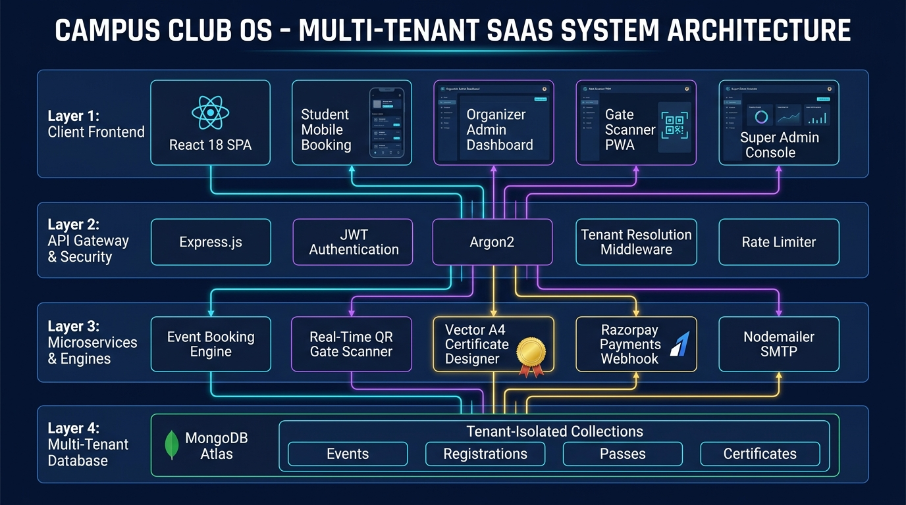

# 🏛️ Multi-Tenant Campus Club & Event Management SaaS Platform
[](https://reactjs.org/)
[](https://nodejs.org/)
[](https://www.mongodb.com/)
[](https://tailwindcss.com/)
[](LICENSE)
> **A Production-Grade Multi-Tenant SaaS platform designed for Universities and Colleges to manage end-to-end Club operations, Event Ticketing, Real-Time Dynamic QR Gate Verification, Automated A4 Vector Certificate Generation, and Razorpay Payments.**
---
## 📸 Architecture & System Design Overview

---
## ✨ Key Features
### 🏢 1. True Multi-Tenant Architecture
* **Isolated Sub-Portals**: Every campus organization (Dance Club, Coding Club, Sports, etc.) gets its own branded portal (`/club/:slug`).
* **Tenant Discriminator Pattern**: Complete data separation at the database layer ensuring high performance and security.
* **Custom Brand Identity**: Dynamically customize club colors, themes, logos, and admin access.
### 🎟️ 2. Real-Time QR Gate Scanner (PWA)
* **Cryptographic Pass Generation**: Instant PDF/SVG digital ticketing with unique hashed identifiers.
* **Camera Scanner PWA**: Gate volunteers scan attendee QR passes directly through their mobile browser camera.
* **Anti-Fraud & Duplicate Prevention**: Real-time atomic database check-in locks that instantly reject duplicate or forwarded pass attempts.
### 🎓 3. Dynamic A4 Vector Certificate Engine
* **A4 Standard Aspect Ratio (1.414:1)**: Mathematical vector SVGs with CSS `@media print` rules for crisp physical printing.
* **Custom Template Uploader**: Club admins can upload custom certificate frames with drag-and-drop support.
* **Official Digital Signatures & Gold Seal**: Dynamic signatory names, titles, ink strokes, and anti-tamper verification hashes.
* **1-Click Email Dispatch**: Direct automated inbox delivery with high-resolution vector attachments.
### 📱 4. Direct Club QR Link Sharing
* Instant poster-ready QR code generation for public portals so students can scan with **Google Lens / Mobile Camera** and register on the spot.
### 💳 5. Payment Gateway & Global Governance
* **Razorpay Integration**: Seamless handling of both Free and Paid ticket reservations.
* **Super Admin Console**: Campus-wide revenue tracking, cross-club activity leaderboards, department analytics, and master certificate registry.
---
## 🛠️ Technology Stack
| Layer | Technology |
| :--- | :--- |
| **Frontend** | React 18, Vite, React Router v6, Lucide Icons, Recharts, Tailwind CSS |
| **Backend** | Node.js, Express.js (REST API Architecture) |
| **Database** | MongoDB Atlas, Mongoose ODM |
| **Security & Auth** | JWT (JSON Web Tokens), Argon2 / Bcrypt Hashing, Role-Based Access Control |
| **Hardware / Scanner** | HTML5 Camera API, ZXing QR Library |
| **Integrations** | Razorpay SDK, Nodemailer SMTP, Resend API |
---
## 🚀 Getting Started Locally
### 1. Clone the repository
```bash
git clone https://github.com/Ankitku02/Multi-Tenant-Campus-Club-Event-Management-SaaS.git
cd Multi-Tenant-Campus-Club-Event-Management-SaaS
2. Setup Backend
bash
cd backend
npm install
Create a .env file in the backend/ directory:

env
PORT=5000
MONGO_URI=your_mongodb_connection_string
AUTH_JWT_SECRET=your_auth_jwt_secret
PASS_JWT_SECRET=your_event_pass_secret
EMAIL_USER=your_email@gmail.com
EMAIL_PASS=your_gmail_app_password
RAZORPAY_KEY_ID=your_razorpay_key
RAZORPAY_KEY_SECRET=your_razorpay_secret
Run the backend server:

bash
node server.js
3. Setup Frontend
bash
cd ../frontend
npm install
npm run dev
Open http://localhost:5173 in your browser.

📂 Project Structure
├── backend/
│   ├── config/          # Database connection
│   ├── middleware/      # Auth & Tenant resolution guards
│   ├── models/          # Mongoose Schemas (Tenant, Event, Registration, User)
│   ├── routes/          # API Controllers (Events, Registrations, Scanner, SuperAdmin)
│   └── server.js        # Central Express server
├── frontend/
│   ├── src/
│   │   ├── pages/       # Portal views, Admin dashboards, Scanner, Cert viewer
│   │   ├── App.jsx      # Client routing
│   │   └── index.css    # Tailwind & A4 Print styles
│   └── vite.config.js
├── SYSTEM_DESIGN_ARCHITECTURE.md
└── CAMPUS_CLUB_OS_SYSTEM_ARCHITECTURE.jpg
📄 License
This project is licensed under the MIT License.
