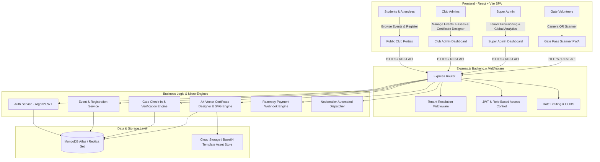
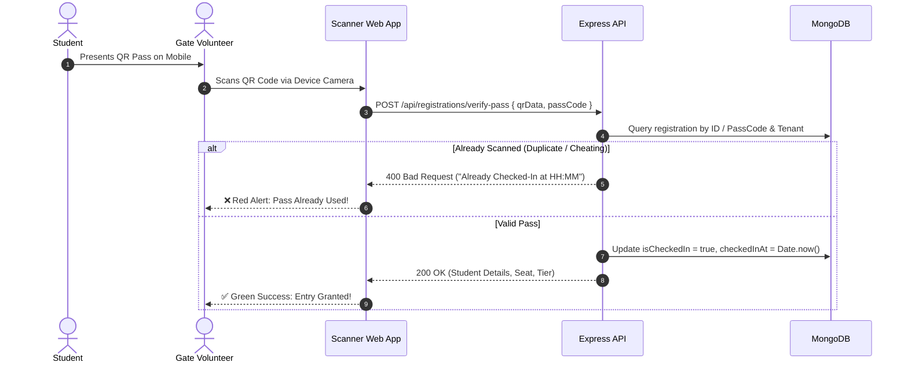
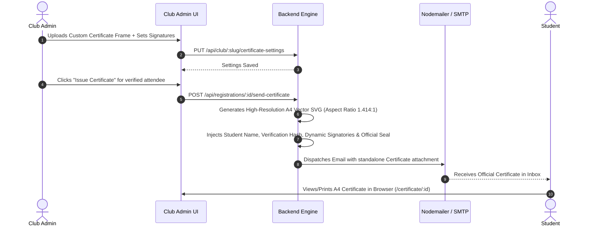

# 🏛️ System Design & Architecture Document
## Multi-Tenant Campus Club & Event Management SaaS

---

## 1. Executive Summary & Pitch (Interview / Presentation Hook)

> **"A Production-Grade Multi-Tenant SaaS platform designed for Universities and Colleges to manage end-to-end Club operations, Event Ticketing, Real-Time Dynamic QR Gate Verification, Automated Vector Certificate Generation, and Razorpay Payments."**

### 🎯 Key Problem it Solves
* **Campus Disorganization**: College clubs previously managed registrations in Google Forms, manual spreadsheets, and physical pass distribution.
* **Gate Security Vulnerabilities**: Screenshots and forwarded tickets caused gate crowding and unauthorized entries.
* **Post-Event Chaos**: Creating and mailing hundreds of completion certificates manually took days.

### 💡 The SaaS Solution
* **Multi-Tenancy**: Every college club gets its own isolated branded portal (`/club/:slug`), analytics, custom certificate templates, and event roster.
* **Direct Club QR Link Generator**: Instant generation and downloadable poster PNGs of club registration links (`/club/:slug`) for students to scan with Google Lens / Camera and register on the spot.
* **Cryptographic / Dynamic QR Passes**: Automated PDF/SVG ticketing with unique registration hashes verified instantly at the gate.
* **Instant A4 Certificate Engine**: 1-click issuance of standard A4 certificates with digital signatures, verification hashes, and direct email delivery.

---

## 2. High-Level System Architecture Diagram



---

## 3. Core Architectural Highlights

### 🏢 A. Multi-Tenant Data Isolation Pattern
* **Model Used**: Shared Database, Tenant Discriminator Pattern (`tenantId` / `tenantSlug` on all collections).
* **Benefits**: Cost-effective for SaaS scalability while providing strict logical separation.
* **Tenant Middleware**: Resolves tenant identity from route slugs (e.g., `/club/dance-club/...`) or header tokens, injecting `req.tenant` automatically into subsequent controllers.

```
+-------------------------------------------------------------+
|                      MongoDB Database                       |
|                                                             |
|  +--------------------+  +-------------------------------+  |
|  | Tenant Collection  |  | Event Collection (tenantId)   |  |
|  | - Dance Club       |  | - Salsa Night (Dance Club)    |  |
|  | - Coding Club      |  | - Hackathon (Coding Club)     |  |
|  | - Robotics Club    |  | - RoboWars (Robotics Club)    |  |
|  +--------------------+  +-------------------------------+  |
|                                                             |
|  +-------------------------------------------------------+  |
|  | Registration & Certificate Collection (tenantId)      |  |
|  | - Attendee Passes, Scanned Status, Certificate Hashes  |  |
|  +-------------------------------------------------------+  |
+-------------------------------------------------------------+
```

---

### 🎟️ B. Real-Time Gate Pass Verification Flow



---

### 🎓 C. Dynamic Vector Certificate Engine Flow



---

## 4. Database Schema (Data Models)

### 1. `Tenant` (Club)
| Field | Type | Description |
| :--- | :--- | :--- |
| `name` | String | Club name (e.g., "Dance Club") |
| `slug` | String (Unique) | URL identifier (e.g., `dance-club`) |
| `category` | String | Cultural / Tech / Sports |
| `adminEmail` | String | Club Admin email |
| `certificateTemplateUrl` | String | Base64 / URL custom background frame |
| `signatory1Name / Title` | String | Primary authority signature name & title |
| `signatory2Name / Title` | String | Secondary authority signature name & title |

### 2. `Event`
| Field | Type | Description |
| :--- | :--- | :--- |
| `tenantId` | ObjectId (Ref Tenant) | Parent Club |
| `title` | String | Event Name |
| `ticketPrice` | Number | 0 for Free, or ₹ Amount |
| `capacity` | Number | Max allowed registrations |
| `venue` | String | Campus Location / Audiorium |
| `startDate / endDate` | Date | Schedule |

### 3. `Registration` (Passes & Certificates)
| Field | Type | Description |
| :--- | :--- | :--- |
| `tenantId` | ObjectId | Club reference |
| `eventId` | ObjectId | Event reference |
| `userName` | String | Attendee Name |
| `userEmail` | String | Attendee Email |
| `passCode` | String (Unique) | Unique Alpha-Numeric Pass Code |
| `qrCode` | String | Cryptographic Base64 QR Image |
| `isCheckedIn` | Boolean | True once scanned at gate |
| `checkedInAt` | Date | Gate verification timestamp |
| `certificateIssued` | Boolean | True once issued |
| `certificateHash` | String | Anti-fraud verification code |

---

## 5. Technology Stack Summary

| Layer | Technologies Used | Key Reason for Choice |
| :--- | :--- | :--- |
| **Frontend** | React 18, Vite, React Router v6, Tailwind CSS / Lucide Icons | Ultra-fast rendering, modular component hierarchy, responsive mobile layout |
| **Backend** | Node.js, Express.js | Event-driven, non-blocking I/O for concurrent requests & QR verification |
| **Database** | MongoDB + Mongoose ODM | Flexible schema for multi-tenant metadata & fast index lookups |
| **Security** | Argon2 / Bcrypt, JWT (JSON Web Tokens), CORS policy | Industrial standard hashing and stateless auth |
| **Realtime/Hardware** | HTML5 Camera API / ZXing Scanner Library | In-browser gate scanning without requiring native app install |
| **Media & Vector** | SVG Vector Rendering Engine, Canvas API | Crystal clear A4 printing without pixelation |
| **Integrations** | Razorpay SDK, Nodemailer (SMTP) | Automated payment collections & instant transactional emails |

---

## 6. How to Explain in an Interview (Cheat Sheet)

### 🎙️ 60-Second Elevator Pitch:
> *"I built a full-stack Multi-Tenant SaaS platform for managing campus clubs and college events. It replaces manual registration forms with a complete digital ecosystem. Key highlights include an isolated multi-tenant architecture where each club has its own sub-portal and branding, a high-throughput QR code gate verification system that prevents duplicate entries, and an automated A4 vector certificate engine with custom template uploads and digital signatures."*

### 💡 Key Technical Questions Interviewers Might Ask & How to Answer:

#### Q1: How did you handle Multi-Tenancy in MongoDB?
* **Answer**: *"I implemented a Tenant Discriminator pattern with indexing on `tenantId` across all event and registration collections. This provides database query efficiency, low hosting overhead, and robust data isolation through tenant resolution middleware."*

#### Q2: How do you prevent ticket fraud at the gate?
* **Answer**: *"Every ticket is issued with a unique encrypted verification hash and QR code. When scanned by the gate camera, an atomic update in MongoDB sets `isCheckedIn: true` with a timestamp. If someone tries to scan the same QR code again or send a screenshot to a friend, the scanner immediately alerts the volunteer with a duplicate scan error."*

#### Q3: How does the certificate generation stay sharp across all printers?
* **Answer**: *"Instead of using low-res raster images, the platform renders certificates as mathematical A4 vector SVGs (1414 x 1000 standard aspect ratio) with embedded Google Fonts, gold authentic seal, and high-fidelity vector signatures. It includes CSS `@media print` rules for perfect physical paper output."*
